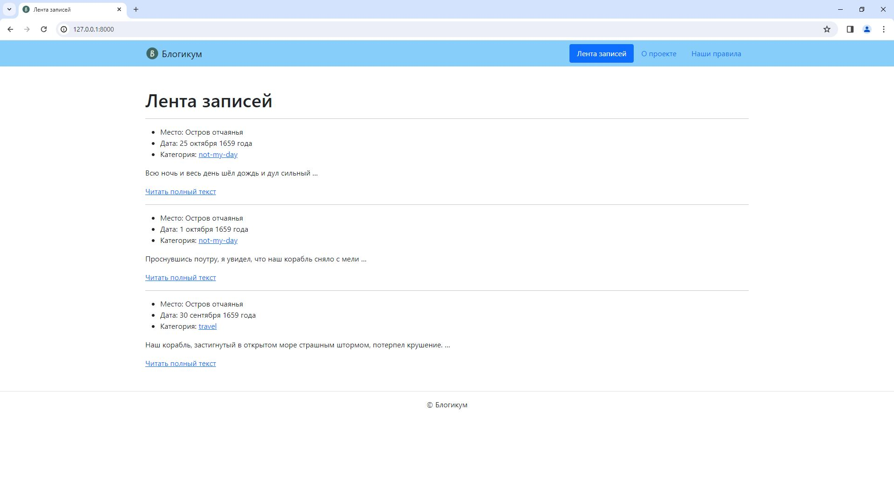

# Блогикум

<details>
  <summary>Нажмите, чтобы развернуть</summary>
  
</details>

## Технологии:

- Python 3.9
- Django 3.2

## Установка окружения

### Склонируйте проект «Блогикум» в папку *Dev/*.

Должна получиться такая структура:

```
Dev/
 └──django_sprint1/
     ├──blogicum
     ├──html
     ├──tests
     ├──.flake8
     ├──.gitignore
     ├──LICENSE
     ├──pytest.ini
     ├──README.md
     ├──requirements.txt
     ├──setup.cfg
```

### Создайте виртуальное окружение

1. Запустите редактор Visual Studio Code и через меню *«Файл» / «Открыть директорию»* откройте папку *Dev/django_sprint1/*.
2. Запустите терминал в VS Code, удостоверьтесь, что вы работаете из директории *django_sprint1/* (если вы работаете под Windows, убедитесь, что в терминале запущен Git Bash, а не PowerShell или что-нибудь ещё), и выполните команду:

- Linux/macOS:

  ```
  python3 -m venv venv
  ```

- Windows:

  ```
  python -m venv venv

  или

  py -3 -m venv venv
  ```

В директории *django_sprint1/* будет развёрнуто виртуальное окружение и появится папка `venv`, в которой будут храниться все зависимости проекта, а структура файлов станет такой:

```
Dev/
 └──django_sprint1/
     ├──...
     ├──venv
     ├──...
```

### Активация виртуального окружения

В терминале перейдите в корневую директорию проекта *Dev/django_sprint1/* и выполните команду:

- Linux/macOS:

  ```
  source venv/bin/activate
  ```

- Windows:
  ```
  source venv/Scripts/activate
  ```

Теперь все команды в терминале будут предваряться строкой `(venv)`.

❗ Все дальнейшие команды в терминале надо выполнять с активированным виртуальным окружением.

Обновите pip:

- Linux/macOS:

  ```
  python3 -m pip install --upgrade pip
  ```

- Windows:
  ```
  python -m pip install --upgrade pip
  ```

### Установка зависимостей из файла *requirements.txt*:

Находясь в папке *Dev/django_sprint1/*, выполните команду:

```
pip install -r requirements.txt
```

### Применение миграций

В директории с файлом manage.py выполните команду:

```
python manage.py migrate
```

### Запуск проекта в dev-режиме

В директории с файлом manage.py выполните команду:

- Linux/macOS:

  ```
  python3 manage.py runserver
  ```

- Windows:
  ```
  python manage.py runserver
  ```

В ответ Django сообщит, что сервер запущен и проект доступен по адресу [http://127.0.0.1:8000/](http://127.0.0.1:8000/)
